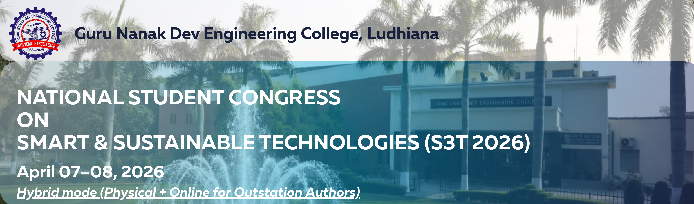

<h1 align="center">S3T 2026</h1>

<b>National Student Congress on Smart & Sustainable Technologies</b> 
Guru Nanak Dev Engineering College, Ludhiana

<a href="#about"><b>About</b></a> •
<a href="Downloads/Brochure_S3T-2026.png"><b>Brochure</b></a> •
<a href="#tracks"><b>Tracks</b></a> •
<a href="#submission"><b>Submission</b></a> •
<a href="Downloads/Full_Paper_Template.docx"><b>Full Length Paper Template</b></a> •
<a href="Downloads/S3T_2026_Session Schedule.pdf"><b>Session Schedule</b></a> •
<a href="#presentation"><b>Presentation Guidelines</b></a> •
<a href="#important-dates"><b>Important Dates</b></a> •
<a href="#registration"><b>Registration</b></a> •
<a href="#committee"><b>Committee</b></a> •
<a href="#contact"><b>Contact</b></a>

---

## About the Congress 

The **Student Congress on Smart & Sustainable Technologies (S3T 2026)** is a national-level multidisciplinary platform hosted at **Guru Nanak Dev Engineering College, Ludhiana**.

It brings together **undergraduate students, postgraduate students, and research scholars** to present innovative ideas and research addressing real-world engineering challenges.

Aligned with the vision of **Viksit Bharat @ 2047**, the congress promotes:
- Innovation and sustainability  
- Interdisciplinary collaboration  
- Industry-relevant research  

---

## Conference Tracks 

<table width="100%">
<tr>

<td width="25%" valign="top" style="background:#eef6ff; padding:15px;">
<b style="color:#003366;">Civil Engineering</b> 
<i>Sustainable Infrastructure</i>
<ul>
<li>Structural Health Monitoring &Retrofitting</li>
<li>Durable & Sustainable Construction Materials</li>
<li>Smart Cities & Urban Infrastructure</li>
<li>Geotechnical Engineering & Ground Improvement Techniques</li>
<li>Transportation Engineering & Smart Mobility</li>
<li>Water Resources & Environmental Engineering</li>
<li>Distaster Mitigation & Structural Safety</li>
<li>Building Information Modelling</li>
</ul>
</td>

<td width="25%" valign="top" style="background:#fff5e6; padding:15px;">
<b style="color:#cc6600;">Electrical Engineering</b> 
<i>Smart Energy Systems</i>
<ul>
<li>Renewable Energy Systems & Integration</li>
<li>Smart Grids & Energy Storage</li>
<li>Power Electronics & Devices</li>
<li>Electric Vehicles & Charging Infrastructure</li>
<li>Energy Efficiency and Sustainability</li>
<li>High Voltage Engineering & Power Systems</li>
<li>Smart & Efficient Electrical Machines</li>
</ul>
</td>

<td width="25%" valign="top" style="background:#eefbea; padding:15px;">
<b style="color:#2c7a2c;">Electronics & Communication</b> 
<i>AI, IoT & Communication</i>
<ul>
<li>Sustainable & Green Electronics</li>
<li>Embedded Systems & IoT</li>
<li>AI/ML in Electronics</li>
<li>VLSI & Nanoelectronics</li>
<li>Biomedical & Healthcare Electronics</li>
<li>5G and 6G communication technologies in RF and optics</li>
<li>Emerging Technologies</li>  
</ul>
</td>

<td width="25%" valign="top" style="background:#f4f0ff; padding:15px;">
<b style="color:#5a3ea1;">Mechanical & Production</b> 
<i>Smart Manufacturing</i>
<ul>
<li>Smart & Digital Manufacturing</li>
<li>Advanced & Sustainable Materials Engineering</li>
<li>Renewable & Thermal Energy Systems</li>
<li>Sustainable Product Design & Lifecycle Engineering</li>
<li>Robotics, Mechatronics & Intelligent Automation</li>
<li>Computational Engineering & Multiphysics Simulation</li>
<li>Energy Efficiency & Decarbonation in Mechanical Systems</li>
</ul>
</td>

</tr>
</table>

---

## Submission Guidelines 

Authors are invited to submit **4–5 page technical papers** aligned with the conference themes.  
All submissions must be original and adhere to standard academic integrity norms.

### Types of Submissions
- Review Papers  
- Experimental Studies  
- Case Studies  
- Analytical & Simulation Work  

### Plagiarism & AI Policy
- The overall similarity index of the manuscript must be **less than 20%**.  
- Content generated using AI tools must not exceed **15%** of the manuscript.  
- Proper citation and referencing are mandatory for all borrowed content.  
- Submissions not complying with these guidelines may be **rejected without review**. 

## Submission Links

<b>Abstract Submission</b> 
<a href="https://tinyurl.com/GNDEC-S3T-2026">Submit Abstract</a> 

<b>Full Paper Submission</b> 
<a href="https://tinyurl.com/GNDEC-S3T-2026-fullpaper">Submit Full Paper</a> 

**[Download Full Paper Template](Downloads/Full_Paper_Template.docx)**  

All accepted and presented papers will be published in **S3T 2026 Proceedings (ISBN).**

---

## Presentation Guidelines 

Authors presenting at **S3T 2026** are required to follow the guidelines below to ensure smooth and effective conduct of sessions.

### Time Allocation
- Each presentation: **8 minutes (max.)**
- Discussion / Q&A: **2 minutes**
- Strict adherence to time limits is mandatory

### Reporting & Attendance
- Authors must report at the venue **at least 30 minutes before the session**
- Only **registered authors** will be allowed to present
- **Each author must register individually** to be eligible for a presentation certificate

### Session Schedule

👉 **[Download Inaugural and Session Schedule](Downloads/S3T_2026_Session Schedule.pdf)**

All participants are requested to carefully note their respective session timings and adhere strictly to the schedule.

Attendance will be marked **15 minutes before the start of each session**, and authors must report to the venue accordingly.

### Presentation Preparation
- Authors are required to prepare their presentation using the official template:
  
👉 [Download Presentation Template](https://docs.google.com/presentation/d/113EjYMo0PI0YhLXF1xzPueJW51pqcRHK/edit?usp=sharing&ouid=102510137308323318501&rtpof=true&sd=true)

- PPT/PDF must be submitted to the session coordinator **before the session begins**

### Best Paper Award
- Each session will have **one Best Paper Award**
- Evaluation will be based on:
  - Technical quality and originality
  - Clarity of presentation
  - Relevance to the theme
  - Response to questions

### Important Instructions
- Ensure the content is **original and plagiarism-compliant**
- Maintain **professional presentation style**
- Avoid excessive text; use figures, charts, and visuals where possible

### Note
>Authors who have received the abstract acceptance email are eligible to present their paper, provided they have completed the registration by paying the fee and filling out the registration form. However, publication of the paper in the ISBN conference proceedings will be subject to quality assessment and plagiarism checks, post the conference.

---

## Important Dates 

| Activity | Date |
|----------|------|
| Abstract Submission | ~~15 March 2026~~ **22 March 2026 (Extended)** |
| Acceptance Notification | 23 March 2026 |
| Registration Deadline | ~~24 March 2026~~ **30 March 2026 (Extended)** |
| Full Paper Submission | ~~30 March 2026~~ **3 April 2026 (Extended)**  |
| Conference Dates | 07–08 April 2026 |

### Note
>Authors who have received the abstract acceptance email are eligible to present their paper, provided they have completed the registration by paying the fee and filling out the registration form. However, publication of the paper in the ISBN conference proceedings will be subject to quality assessment and plagiarism checks, post the conference.

---

## Registration & Payment 

### Registration Link

<a href="https://tinyurl.com/GNDEC-S3T-2026-Registration"><b>Register Here</b></a> 

> Each student author must register individually for participation/presentation certificate.

### Fee Structure

| Category | Fee |
|----------|------|
| UG / PG Students | ₹100 |
| Research Scholars | ₹100 |

### Payment Details

- **Account Name:** Students Chapter Institution of Engineers  
- **Bank:** Punjab & Sind Bank, Gill GNE Ludhiana  
- **Account No.:** 00211000082393  
- **IFSC Code:** PSIB0000021  

---

## Organizing Committee 

### Chief Patron  
Dr. Sehijpal Singh  
*Principal, GNDEC Ludhiana*

### Patrons  
Dr. Jagbir Singh (CE) • Dr. Munish Rattan (ECE) • Dr. Kanwardeep Singh (EE) • Dr. Harmeet Singh (MPE)

### Convenors  
Dr. Yuvraj Singh (CE) • Dr. Gurpuneet Kaur (ECE) • Dr. Chahat Jain (ECE) • Dr. Arvind Dhingra  (EE)
Dr. Raman Kumar (MPE) • Dr. Chamkaur Jindal (MPE)

### Advisory Committee  
Dr. Harvinder Singh (Dean, R & C) • Dr. Puneetpal Singh Cheema (CE) • Dr. Prashant Garg (CE) • Dr. Narwant Singh Grewal (ECE)
Dr. Baljeet Kaur (ECE) • Pf. Preetinder Singh (EE) • Er. Rupinderjit Singh (EE) • Dr. Jasmaninder Singh Grewal (MPE) • Dr. Prem Singh (MPE)

### Organising Committee  

**Civil Engineering:**  
Er. Charnjeet Singh • Er. Amandeep Singh • Er. Sukhwinderpal Singh  

**Electrical Engineering:**  
Dr. Mandeep Kaur • Dr. Ranvir Kaur • Er. Balwinder Singh  

**Electronics & Communication:**  
Er. Harminder Kaur • Dr. Gurjot Kaur Walia • Er. Kuldeepak Singh  

**Mechanical & Production:**  
Dr. Jatinder Pal • Dr. Gulvir Singh • Er. Jagjit Kaur  

---
## Quick Links

&nbsp;

&nbsp;

&nbsp;

---

## Contact 

<b>Conference Secretariat – S3T 2026</b> 
Guru Nanak Dev Engineering College, Ludhiana

✉️ <a href="mailto:s3t.gndec@gmail.com">s3t.gndec@gmail.com</a>

<b>Dr. Yuvraj Singh (CE)</b> &nbsp;&nbsp;|&nbsp;&nbsp; +91 9815830889 
<b>Dr. Arvind Dhingra (EE)</b> &nbsp;&nbsp;|&nbsp;&nbsp; +91 9814163429 
<b>Dr. Chahat Jain (ECE)</b> &nbsp;&nbsp;|&nbsp;&nbsp; +91 7837005620 
<b>Dr. Raman Kumar (ME)</b> &nbsp;&nbsp;|&nbsp;&nbsp; +91 9855100530

---

Guru Nanak Dev Engineering College, Ludhiana 
Innovation • Sustainability • Engineering for the Future  
© 2026 S3T Congress

